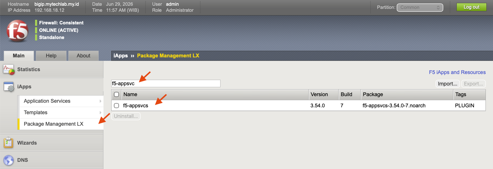
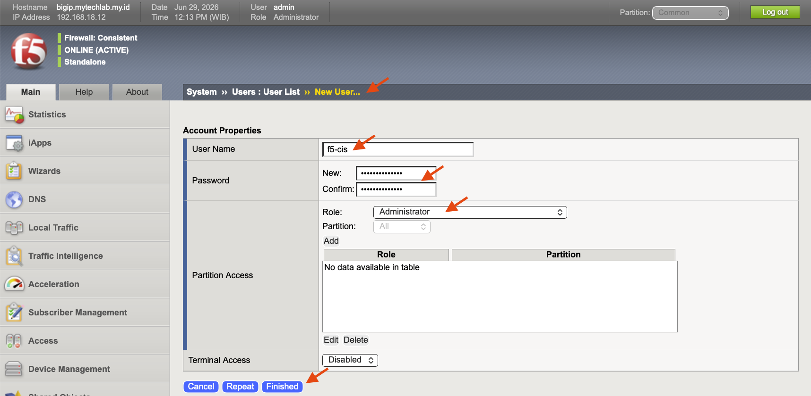

# **UNDER CONSTRUCTION !!!**

References: https://clouddocs.f5.com/containers/latest/userguide/kubernetes/#installing-cis-manually

# F5 Container Ingress Service (CIS) Installation

## Pre-requisites Before Installation

There are several steps we need to do directly on F5 BIG-IP instance before moving to F5 CIS installation & integration.

1. AS3 Module Installation and Validation

    Validate AS3 package installation on BIG-IP at menu **iApps ›› Package Management LX**, and search for **f5-appsvc**. If there is no AS3 package installed, download the package from this [link](https://github.com/f5networks/f5-appsvcs-extension) and install from Configuration Utility as explain on this [link](https://clouddocs.f5.com/products/extensions/f5-appsvcs-extension/latest/userguide/installation.html#installing-big-ip-as3-using-the-big-ip-configuration-utility).

    
  
2. Create a BIG-IP partition for integration with F5 CIS

    CIS will add a configuration on a specified BIG-IP partition. To prepare that we can create a dedicated partition to be managed by F5 CIS, where every config on that partition will be created and managed by F5 CIS. Go to **System ›› Users ›› Partition List**, and click **Create**. For this demo put the partition name as **f5-cis**

    
    
3. Create new user to be used by F5 CIS

    To create new BIG-IP user, go to **System ›› Users ›› User List**, and click **Create**. Give Administrator role as it is mandatory for AS3. For this lab make username **f5-cis** and password **P@ssw0rdF5C!S!**

    

## Step-by-step of F5 CIS Installation
1. Download the CA/BIG IP certificate and use it with CIS controller.
```
echo | openssl s_client -showcerts -servername <server-hostname>  -connect <server-ip-address>:<server-port> 2>/dev/null | openssl x509 -outform PEM > server_cert.pem
```

Create configmap

```
kubectl create configmap trusted-certs --from-file=./server_cert.pem  -n kube-system
```
Alternatively, for non-prod environment you can use --insecure=true parameter.

2. Create RBAC file
```
kubectl create -f k8s_rbac.yaml
```
**Note:** _The command has the broadest supported permission set. You can narrow the permissions down to specific resources, namespaces, etc. to suit your needs._

2. Install Custom Resource Definitions (CRD) for CIS Controller
```
export CIS_VERSION=<cis-version>
# For example
# export CIS_VERSION=v2.20.0
# or
# export CIS_VERSION=2.x-master
# the latter if using a CIS image with :latest label
kubectl create -f https://raw.githubusercontent.com/F5Networks/k8s-bigip-ctlr/${CIS_VERSION}/docs/config_examples/customResourceDefinitions/customresourcedefinitions.yml
```

3. Create secret bigip credential 
```
kubectl create secret generic bigip-login -n kube-system --from-literal=username=admin --from-literal=password=<password>
```
4. Install CIS
```
kubectl create -f cis-installation.yaml
```

## CIS VirtualServer

After installing CIS pods on k8s system and create an application service on the cluster, then we need to create a VirtualServer object to exposed this service on K8S through F5 BIG-IP via CIS. This VirtualServer must be **_created on the same namespace as the application service_**. Run this command to create VirtualServer object:

```
kubectl -n <target-namespace> create -f cis-vs-creation.yaml
```

Refer to the official F5 CIS documentation for other [VirtualServer](https://clouddocs.f5.com/containers/latest/userguide/crd/virtualserver.html) components.